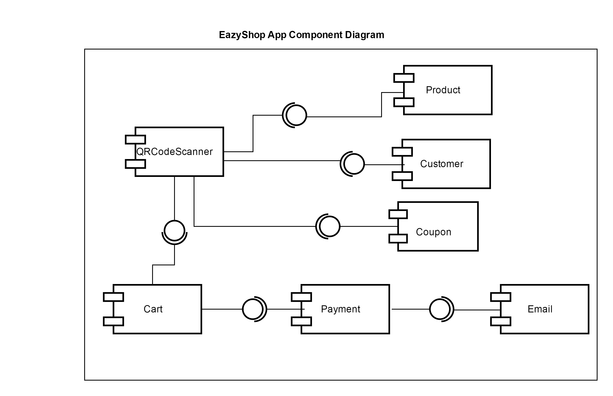
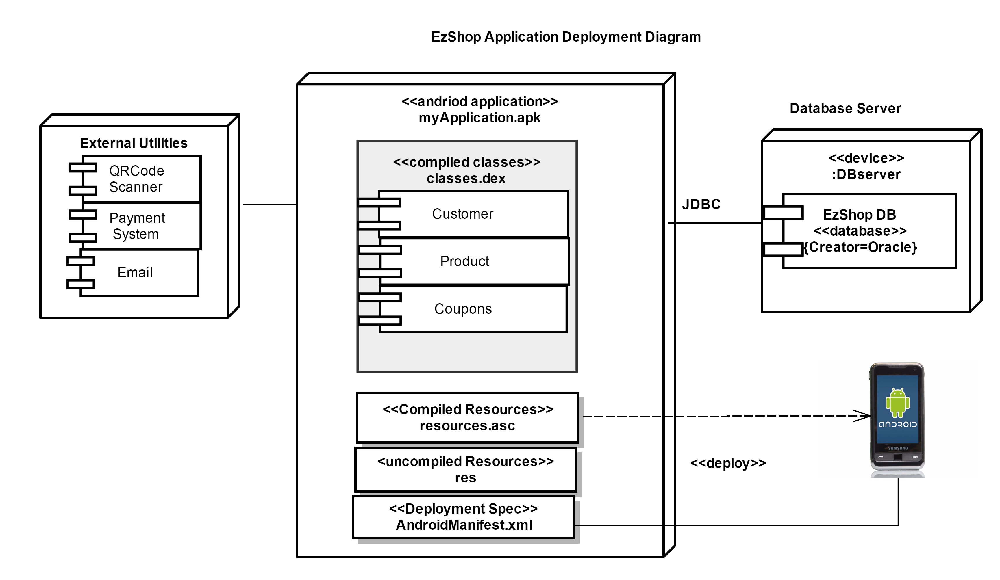
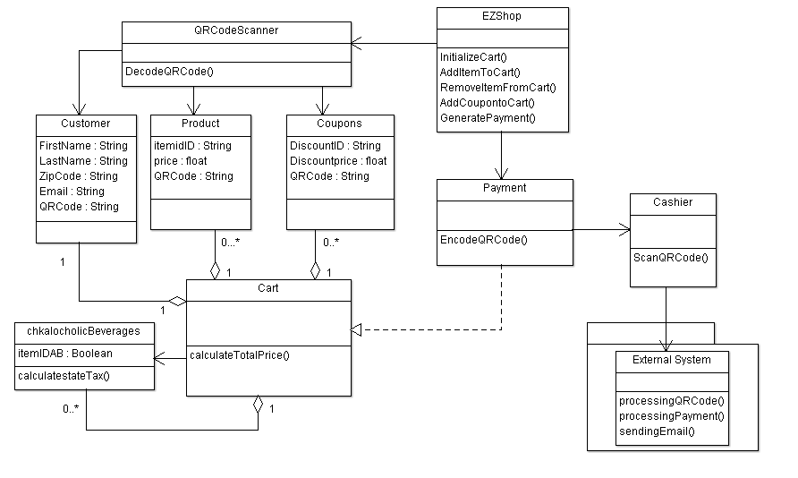
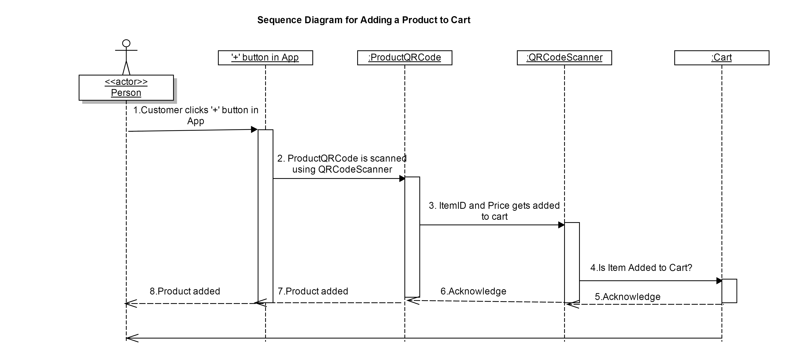
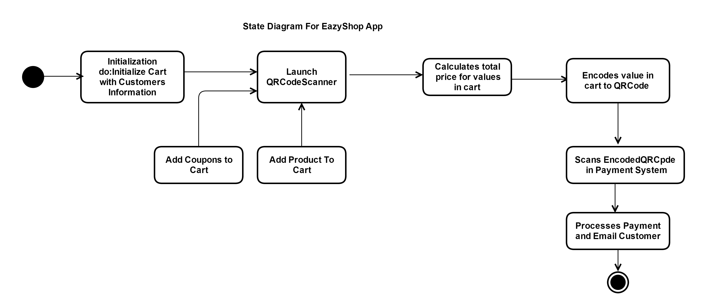
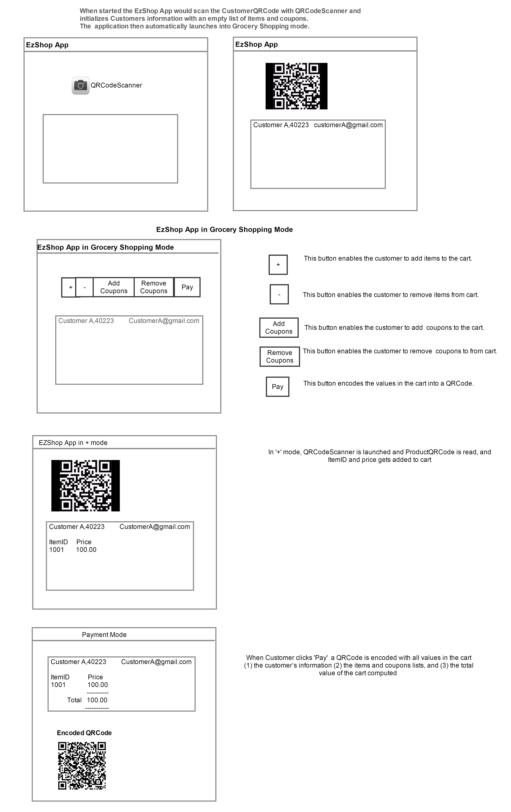

# Design Document

**Author**: Radha Venkataraman (rvenkataraman9)

## 1 Design Considerations

### 1.1 Assumptions

* Payment Processing,QRCode Scanning and Email capabilities are provided by libraries, through utility classes.
* EzShop Android Application is written in Java.
* The .apk file represents an Android application to be deployed to the Android-enabled mobile devices.
* The manifest (deployment specification) file **AndroidManifest.xml** describes application requirements, such as the minimum version of Android required and any supported hardware configurations.It also declares all components in the application.

### 1.2 Constraints

N/A

### 1.3 System Environment

**Hardware Requirements:**  

* Android development tools run on all flavors of computers of relatively recent vintage: Linux, Mac OS, or Microsoft Windows.  
* An Android device such as a smartphone or tablet is useful. 

**Software Requirements:**

The software required for Android development is free and readily available on the Web:

1. The Java Development Kit (JDK).
2. The Eclipse IDE (Java Developers version) with the Android plugin.  
3. The Android SDK and add-ons such as the Google Maps SDK.

## 2 Architectural Design

### 2.1 Component Diagram

* Components Product,Customer and Coupons go through QRCodeScanner and their decoded values are added into the Cart. 
* Payment System is called with a QRCode generated encoding all the values from Cart.
* Payment System processes the QRCode and concludes payment. 
* Email is sent to the  Customer upon successful transaction.

Click on the link to view the Component Diagram [Component Diagram](ComponentDiagram.pdf).

### 2.2 Deployment Diagram

* Compiled Java class files are deployed into Android Device. 
* Product,Coupons,Customer and Cart details are stored in the Oracle database.
* External utilities that communicates with the Application are'QRCodeScanner' 'Payment System' and 'Email System'. 
 
Click on the link to view the Deployment Diagram [Deployment Diagram](DeploymentDiagram.pdf). 
 
## 3 Low-Level Design

### 3.1 Class Diagram

Click on the link  to view the [Class Diagram](ClassDiagram.pdf). 

### 3.2 Other Diagrams

**Sequence Diagram**

 This sequence diagram represents the flow of the Application when a product is added to the Cart.

Click on the link to view the [Sequence Diagram](SequenceDiagram.pdf) 

**State Diagram**

This State diagram represents the overall events that cause a transition from one state to another.

Click on the link to view the [State Transition Diagram](StateDiagram.pdf) 

## 4 User Interface Design

Click on the link  to view the [User Interface Design](UserInterfaceDesign.pdf). 
