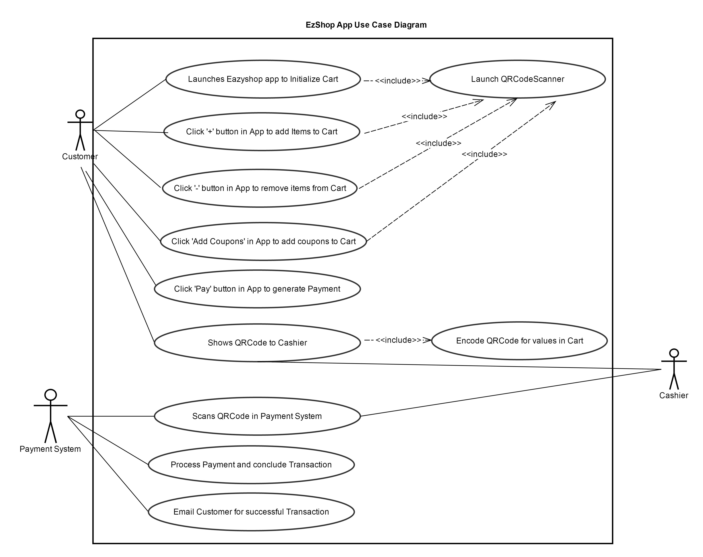

# Use Case Model

**Author**: Radha Venkataraman (rvenkataraman9)

## 1 Use Case Diagram

Click on the link to view the [UseCaseDiagram](UsecaseDiagram.pdf) 

## 2 Use Case Descriptions

**1. Launches Eazyshop App to Initialize Cart includes Launch QRCodeScanner.**   
1a. Customer launches the Eazyshop App, the App would decode CustomerQRCode by launching QRCodeScanner an empty cart with Customers information along with empty list of items and coupons gets initialized.  
1b. Customer should have a valid QRCode encoded with FirstName,LastName,Email and Zipcode.  
1c. An empty cart should be initialized with the customer's information.   
1d. The Application should throw an error message if the Customer does not have a QRCode or QRCodeScanner is not working.

**2. Click '+' button in App to add items to Cart includes Launch QRCodeScanner.**  
2a.Customer should click '+' button in App, the app would scan the ProductQRCode launching the QRCodeScanner. ItemID and price gets added to the cart.  
2b.Every product should have a valid QRCode.  
2c.ItemID and Price of the product should be added to the customer's cart.  
2d.The Application should throw an error message if the product does not have a QRCode or QRCodeScanner is not working.

**3. Click 'Add Coupons' button to add Coupons to Cart includes Luanch QRCodescanner.**  
3a. Customer should click 'Add Coupons' button in App, the app would scan CouponQRCode launching the QRCodeScanner. DiscountID and DiscountAmount that matches with the ItemID gets added to the cart.    
3b. Every coupon should have a valid QRCode.  
3c. DiscountID and DiscountAmount should be added to the customers cart.  
3d. The Application should throw an error message if the coupon does not have a QRCode or QRCodeScanner is not working.

**4. Click '-' button to remove items from Cart includes Launch QRCodeScanner.**  
4a. Customer should click '-' button in App, the app would scan the ProductQRCode launching the QRCodeScanner and the corresponding itemID and price needs to be removed from the Cart.  
4b. Customer must have added the item already in the Cart in order to remove it.  
4c. ItemID and the price selected should be removed from the cart.  
4d. The Application should throw an error message if the productQRCode is not already in the cart or QRCodeScanner is not working.

**5. Click 'Pay' button in App to generate Payment**  
5a. Customer should click 'Pay' button in App. The App would check and add a Special tax for Alcoholic beverages whose ItemID is prefixed with 'AB'. The total price value of the cart is calculated.
5b. Customer should select the Pay button in the EZShop App.  
5c. Total price value must be generated for the values in the cart. 
5d. The Application should throw an error message if there is an issue when computing total price. 

**6.Shows QRCode to Cashier includes Encode QRCode for values in Cart**  
6a. Customer should show the Encoded QRCode to Cashier.
6b. A QRCode should have been generated encoding all the information in the cart including Customer's Information,Itemid, coupons, and total price.  
6c. Customer must show the encoded QRCode value to Cashier.    
6d. The Application should throw an error message if encoding QRCode is not successful. 

**7.Scans QRCode in Payment System**  
7a.Cashier should scan the Encoded QRCode in the Payment System.  
7b.There should be an QRCode generated encoding all the values in the cart.  
7c.The encoded QRCode must be passed to the External Payment System to process payment.
7d. The Application show throw an error message if Scanning the encoded QRCode is not successful.

**8.Process Payment Method from Customer**  
8a. The Payment System should processes the payment method of Customer,conclude the transaction and email Customer when the payment is successful.  
8b. Customer should provide a valid payment method.  
8c. The transaction must be concluded and email must be sent if payment is successful.
8d. The Payment system should throw an error message if there is an invalid mode of payment or if the email id is invalid.
